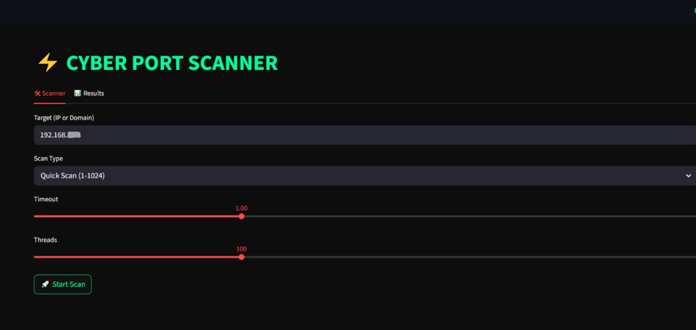
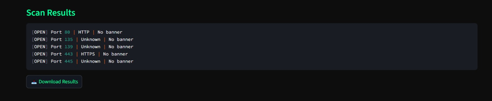
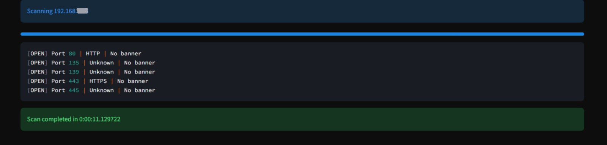

```

█████████████████████████████████████████████████████████████████████████████████████████████████████████████████████████████████████████████████████████████████████████████████████████████████████████████
█░░░░░░░░░░░░░░█░░░░░░░░░░░░░░█░░░░░░░░░░░░░░░░███░░░░░░░░░░░░░░████████████████░░░░░░░░░░░░░░█░░░░░░░░░░░░░░█░░░░░░░░░░░░░░█░░░░░░██████████░░░░░░█░░░░░░██████████░░░░░░█░░░░░░░░░░░░░░█░░░░░░░░░░░░░░░░███
█░░▄▀▄▀▄▀▄▀▄▀░░█░░▄▀▄▀▄▀▄▀▄▀░░█░░▄▀▄▀▄▀▄▀▄▀▄▀░░███░░▄▀▄▀▄▀▄▀▄▀░░████████████████░░▄▀▄▀▄▀▄▀▄▀░░█░░▄▀▄▀▄▀▄▀▄▀░░█░░▄▀▄▀▄▀▄▀▄▀░░█░░▄▀░░░░░░░░░░██░░▄▀░░█░░▄▀░░░░░░░░░░██░░▄▀░░█░░▄▀▄▀▄▀▄▀▄▀░░█░░▄▀▄▀▄▀▄▀▄▀▄▀░░███
█░░▄▀░░░░░░▄▀░░█░░▄▀░░░░░░▄▀░░█░░▄▀░░░░░░░░▄▀░░███░░░░░░▄▀░░░░░░████████████████░░▄▀░░░░░░░░░░█░░▄▀░░░░░░░░░░█░░▄▀░░░░░░▄▀░░█░░▄▀▄▀▄▀▄▀▄▀░░██░░▄▀░░█░░▄▀▄▀▄▀▄▀▄▀░░██░░▄▀░░█░░▄▀░░░░░░░░░░█░░▄▀░░░░░░░░▄▀░░███
█░░▄▀░░██░░▄▀░░█░░▄▀░░██░░▄▀░░█░░▄▀░░████░░▄▀░░███████░░▄▀░░████████████████████░░▄▀░░█████████░░▄▀░░█████████░░▄▀░░██░░▄▀░░█░░▄▀░░░░░░▄▀░░██░░▄▀░░█░░▄▀░░░░░░▄▀░░██░░▄▀░░█░░▄▀░░█████████░░▄▀░░████░░▄▀░░███
█░░▄▀░░░░░░▄▀░░█░░▄▀░░██░░▄▀░░█░░▄▀░░░░░░░░▄▀░░███████░░▄▀░░█████░░░░░░░░░░░░░░█░░▄▀░░░░░░░░░░█░░▄▀░░█████████░░▄▀░░░░░░▄▀░░█░░▄▀░░██░░▄▀░░██░░▄▀░░█░░▄▀░░██░░▄▀░░██░░▄▀░░█░░▄▀░░░░░░░░░░█░░▄▀░░░░░░░░▄▀░░███
█░░▄▀▄▀▄▀▄▀▄▀░░█░░▄▀░░██░░▄▀░░█░░▄▀▄▀▄▀▄▀▄▀▄▀░░███████░░▄▀░░█████░░▄▀▄▀▄▀▄▀▄▀░░█░░▄▀▄▀▄▀▄▀▄▀░░█░░▄▀░░█████████░░▄▀▄▀▄▀▄▀▄▀░░█░░▄▀░░██░░▄▀░░██░░▄▀░░█░░▄▀░░██░░▄▀░░██░░▄▀░░█░░▄▀▄▀▄▀▄▀▄▀░░█░░▄▀▄▀▄▀▄▀▄▀▄▀░░███
█░░▄▀░░░░░░░░░░█░░▄▀░░██░░▄▀░░█░░▄▀░░░░░░▄▀░░░░███████░░▄▀░░█████░░░░░░░░░░░░░░█░░░░░░░░░░▄▀░░█░░▄▀░░█████████░░▄▀░░░░░░▄▀░░█░░▄▀░░██░░▄▀░░██░░▄▀░░█░░▄▀░░██░░▄▀░░██░░▄▀░░█░░▄▀░░░░░░░░░░█░░▄▀░░░░░░▄▀░░░░███
█░░▄▀░░█████████░░▄▀░░██░░▄▀░░█░░▄▀░░██░░▄▀░░█████████░░▄▀░░████████████████████████████░░▄▀░░█░░▄▀░░█████████░░▄▀░░██░░▄▀░░█░░▄▀░░██░░▄▀░░░░░░▄▀░░█░░▄▀░░██░░▄▀░░░░░░▄▀░░█░░▄▀░░█████████░░▄▀░░██░░▄▀░░█████
█░░▄▀░░█████████░░▄▀░░░░░░▄▀░░█░░▄▀░░██░░▄▀░░░░░░█████░░▄▀░░████████████████████░░░░░░░░░░▄▀░░█░░▄▀░░░░░░░░░░█░░▄▀░░██░░▄▀░░█░░▄▀░░██░░▄▀▄▀▄▀▄▀▄▀░░█░░▄▀░░██░░▄▀▄▀▄▀▄▀▄▀░░█░░▄▀░░░░░░░░░░█░░▄▀░░██░░▄▀░░░░░░█
█░░▄▀░░█████████░░▄▀▄▀▄▀▄▀▄▀░░█░░▄▀░░██░░▄▀▄▀▄▀░░█████░░▄▀░░████████████████████░░▄▀▄▀▄▀▄▀▄▀░░█░░▄▀▄▀▄▀▄▀▄▀░░█░░▄▀░░██░░▄▀░░█░░▄▀░░██░░░░░░░░░░▄▀░░█░░▄▀░░██░░░░░░░░░░▄▀░░█░░▄▀▄▀▄▀▄▀▄▀░░█░░▄▀░░██░░▄▀▄▀▄▀░░█
█░░░░░░█████████░░░░░░░░░░░░░░█░░░░░░██░░░░░░░░░░█████░░░░░░████████████████████░░░░░░░░░░░░░░█░░░░░░░░░░░░░░█░░░░░░██░░░░░░█░░░░░░██████████░░░░░░█░░░░░░██████████░░░░░░█░░░░░░░░░░░░░░█░░░░░░██░░░░░░░░░░█
█████████████████████████████████████████████████████████████████████████████████████████████████████████████████████████████████████████████████████████████████████████████████████████████████████████████
```

<h1 align="center">GHOSTSCAN, A PORT SCANNER</h1>
<p align="center"><i>A fast, multithreaded port scanner with live results, service detection, and banner grabbing — built with Python and Streamlit.</i></p>

---

═══════════════════════════════
OVERVIEW
═══════════════════════════════

𝙋𝙤𝙧𝙩 𝙎𝙘𝙖𝙣𝙣𝙚𝙧 is a Python-based network reconnaissance tool built with Streamlit. It allows users to scan a target host for open TCP ports across a configurable range, with real-time feedback, multithreaded execution, and service banner grabbing. The interface adopts a dark terminal aesthetic designed for clarity and focus during active scans.

---

═══════════════════════════════
OBJECTIVES
═══════════════════════════════

- Provide a fast, multithreaded port scanning engine capable of covering the full 65535 port range
- Display live scan progress and open port results in real time within the browser UI
- Identify common services by port number and attempt to retrieve service banners
- Allow flexible scan configuration including port range, timeout, and thread count
- Export discovered results as a plain-text report for further analysis

---
═════════════════════
TOOLS & TECHNOLOGIES
═════════════════════

<p align="left">
  
  
  
  
  
</p>

---

═════════════════════
PROJECT STRUCTURE
═════════════════════

```
Port_Scanner/
│── app.py
│── README.md
│── Screenshots/
│   │── scanner.png
│   │── scan_results.png
│   │── timestamp.png
```

---

═══════════════════════════════
METHODOLOGY
═══════════════════════════════

### ◈ 𝚃𝚊𝚛𝚐𝚎𝚝 𝚁𝚎𝚜𝚘𝚕𝚞𝚝𝚒𝚘𝚗

The tool accepts either an IP address or a domain name as the scan target. It resolves the hostname to an IP using Python's `socket.gethostbyname()` before initiating any connection attempts, ensuring compatibility with both formats.

### ◈ 𝙼𝚞𝚕𝚝𝚒𝚝𝚑𝚛𝚎𝚊𝚍𝚎𝚍 𝚂𝚌𝚊𝚗𝚗𝚒𝚗𝚐 𝙴𝚗𝚐𝚒𝚗𝚎

Ports are distributed across worker threads via a shared thread-safe queue. Each thread independently attempts a TCP connection to its assigned port using `socket.connect_ex()`. A configurable timeout and thread count allow the user to balance scan speed against network stability. A shared lock ensures safe concurrent updates to the result list and progress counter.

### ◈ 𝚂𝚎𝚛𝚟𝚒𝚌𝚎 𝙸𝚍𝚎𝚗𝚝𝚒𝚏𝚒𝚌𝚊𝚝𝚒𝚘𝚗 & 𝙱𝚊𝚗𝚗𝚎𝚛 𝙶𝚛𝚊𝚋𝚋𝚒𝚗𝚐

After a successful connection, the scanner cross-references the port number against a dictionary of well-known services (FTP, SSH, HTTP, MySQL, etc.). It then attempts to receive a banner from the open socket, which may reveal server software and version information.

### ◈ 𝚁𝚎𝚊𝚕-𝚃𝚒𝚖𝚎 𝚄𝙸 𝙵𝚎𝚎𝚍𝚋𝚊𝚌𝚔

A live progress bar and scrolling result feed update continuously while threads are running. Once all threads complete, the final result set is written to the Results tab and made available for download.

---

═══════════════════════
RESULTS & SCREENSHOTS
═══════════════════════

### 𝚂𝚌𝚊𝚗𝚗𝚎𝚛 𝙸𝚗𝚝𝚎𝚛𝚏𝚊𝚌𝚎



The main scan interface showing target input, scan type selection, timeout slider, thread count configuration, and the live output terminal feed during an active scan.

---

### 𝚂𝚌𝚊𝚗 𝚁𝚎𝚜𝚞𝚕𝚝𝚜



The Results tab displaying discovered open ports along with their associated service names and any captured banners. Results can be downloaded as a `.txt` file directly from this view.

---

### 𝚃𝚒𝚖𝚎𝚜𝚝𝚊𝚖𝚙 & 𝙲𝚘𝚖𝚙𝚕𝚎𝚝𝚒𝚘𝚗



Scan completion summary showing the elapsed duration and a fully populated results log, confirming successful end-to-end execution.

---

══════════════════
COMMANDS & CODE
══════════════════

**Install dependencies:**

```bash
pip install streamlit
```

**Run the application:**

```bash
streamlit run app.py
```

**Core scan logic:**

```python
sock = socket.socket(socket.AF_INET, socket.SOCK_STREAM)
sock.settimeout(timeout)
result = sock.connect_ex((target_ip, port))

if result == 0:
    service = common_ports.get(port, "Unknown")
    banner = sock.recv(1024).decode().strip()
```

---

═══════════════════════════════
CONCLUSION
═══════════════════════════════

𝙋𝙤𝙧𝙩 𝙎𝙘𝙖𝙣𝙣𝙚𝙧 demonstrates the practical application of multithreaded network programming within a polished, browser-based interface. The project reinforces core concepts in socket programming, thread synchronization, and real-time UI rendering. It delivers a functional and extensible reconnaissance tool with a strong emphasis on usability and visual clarity.

---

<p align="center"><i>𝘋𝘦𝘷𝘦𝘭𝘰𝘱𝘦𝘥 𝘢𝘴 𝘱𝘢𝘳𝘵 𝘰𝘧 𝘮𝘺 𝘤𝘺𝘣𝘦𝘳𝘴𝘦𝘤𝘶𝘳𝘪𝘵𝘺 𝘪𝘯𝘵𝘦𝘳𝘯𝘴𝘩𝘪𝘱 𝘸𝘪𝘵𝘩 𝗦𝘆𝗻𝘁𝗲𝗰𝘅𝗛𝘂b</i></p>
